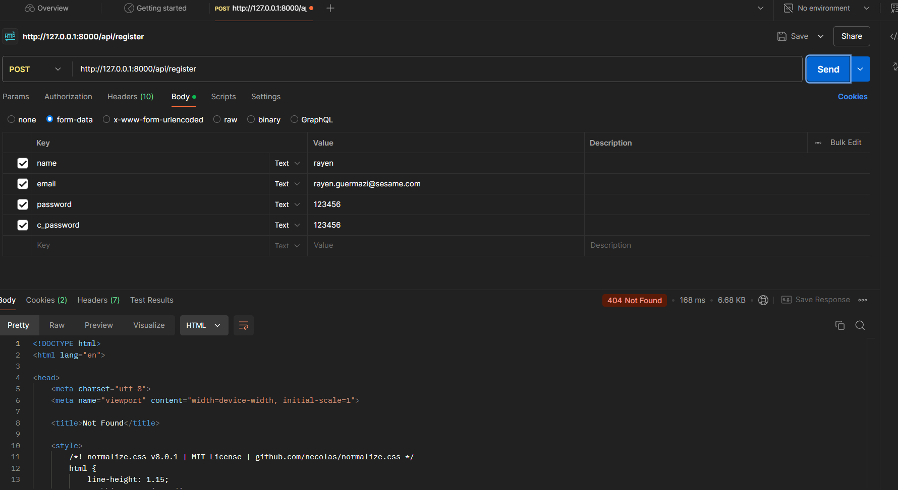
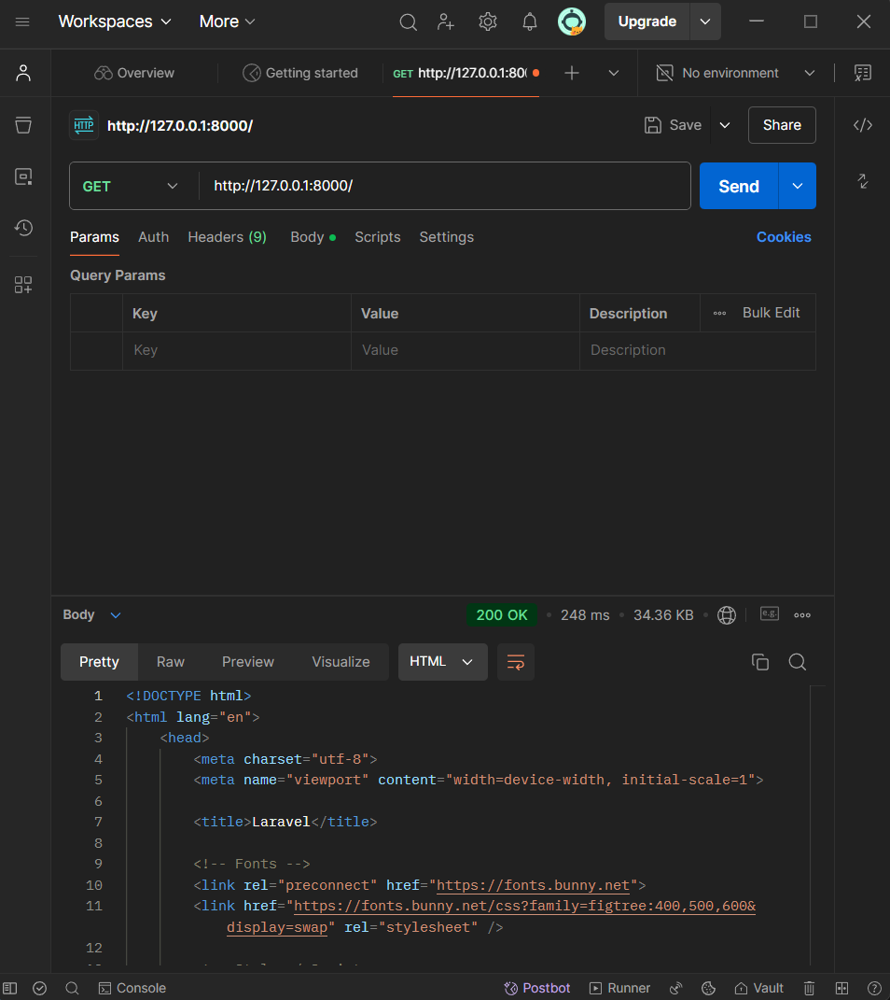
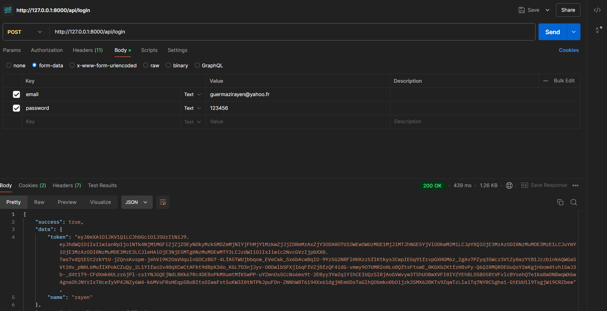
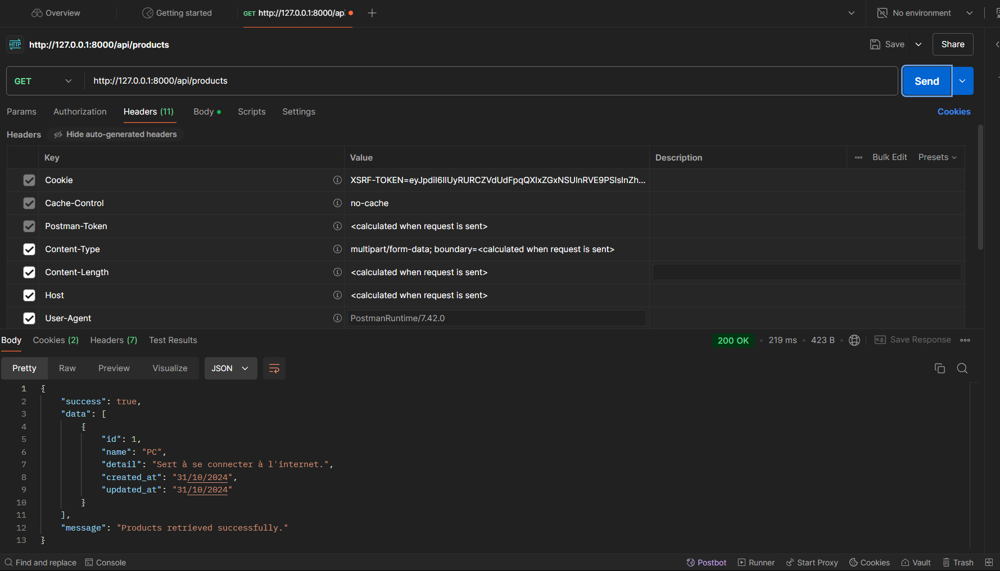

<h1 style="display: inline;">Atelier 09: API Laravel</h1> 

## Créé par : Rayen Guermazi
### Classe : Ing3D

---

### Description
Création d'une API permettant à l'utilisateur de s'inscrire et/ou se connecter, et de consulter les produits disponibles.

---

### Problème
#### Problème: 404 not found
En utilisant Postman pour tester l'API, peu importe le type de requête envoyée et à la route à laquelle on envoit une requête, on retrouve une erreur 404 not found.

 
 
En envoyant une requête GET au serveur, on reçoit cependant le code 200; ce qui veut dire qu'il n'y a pas de problème direct avec le serveur local.

 
 

On peut en conclure que l'erreur ne vient pas du serveur, et que même après s'être assurer que le code est correct, il y a toujours le même problème, qui ne peut donc être qu'un problème de mapping des différentes routes /api/*

### Intuition

Ce problème paraît tout à fait logique au final. A aucun moment on a explicitement dit à notre API qu'elle devait prendre en considération les routes ``/api/register``, ``/api/login`` et ``/api/products`` qui sont déclarées dans le fichier ``api.php`` et non pas dans le standard ``web.php``.

La solution doit donc sûrement être en relation avec ce "mapping".

### Solution
Dans l'**Atelier 08** du tp, on a eu affaire à un problème similaire. On avait bien tout codé, mais l'application ne prenait pas en considération les fonctions qu'on avait déclaré.

Et bien la solution est similaire ! 

    public function map()
    {
        $this->mapApiRoutes();
    }

    /**
     *
     *
     * @return void
     */
    protected function mapApiRoutes()
    {
        Route::prefix('api')
            ->middleware('api')
            ->namespace($this->namespace . '\API')
            ->group(base_path('routes/api.php'));
    }
En créant un Route Service Provider customisé contenant ce code qui va nous permettre de faire manuellement le mapping de la route ``api`` qu'on a créé dans ``api.php``. Cela sera sous ``RouteServiceProvider.php``, et en rajoutant une ligne de code sous ``app/bootstrap/providers.php`` (qui est ``App\Providers\RouteServiceProvider::class,``), on aura donc une API fonctionnelle.

### Test
Après création d'un utilisateur via ``localhost/api/register`` et le login ``localhost/api/login``; on conserve le token pour que l'utilisateur soit pris en considération pour les prochains appels API, car le middleware le requiert.

On fait appel à la liste des produits avec ``localhost/api/products``.

